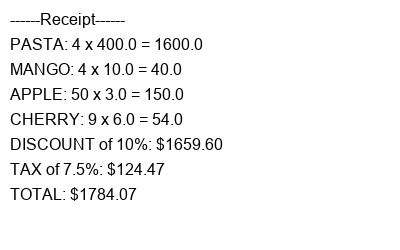

# Receipt Generator App
A Python based business automation tool that streamlines the billing process for retail and food businesses. The system handles the full billing pipeline from product entry to professional receipt generation.

### Preview

### Fig 1: Receipt Image Output

### What This App Does
- Accepts unlimited product entries from the user
- Automatically applies 10% discount on orders over $500
- Calculates 7.5% tax on the final amount
- Generates and saves a receipt as a PNG image
- Displays a full itemised breakdown

### The Problem It Solves
- Human calculation errors that cost businesses money
- Slow billing process that frustrates customers
- Unprofessional documentation for customers
- No digital record keeping of transactions

### Built With
- Python 3
- Pillow (PIL) - for image generation

### What I Learned Building This
- How to use functions and break problems into logical steps
- Dictionary storage and retrieval
- For loops and while loops in real world context
- How to use an external Python library (PIL)
- How to think like a developer - plan first, code second

## System Architecture
Data Collection     →    add_item()
↓
Total Calculation   →    calculate_total()
↓
Discount Engine     →    apply_discount()
↓
Tax Computation     →    tax_calc()
↓
Receipt Generation  →    save_receipt()
↓
Pipeline Controller →    print_receipt()

### How To Install And Run
1. Clone the repository
   git clone https://github.com/Bisiriyu001/receipt-generator.git

2. Install the required library
   pip install Pillow

3. Run the app
   python receipt.py

4. Follow the prompts
   - Enter product names and prices
   - Type 'done' when finished
   - Enter a transaction description
   - Receipt saves as a PNG image!
